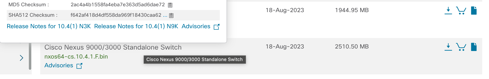
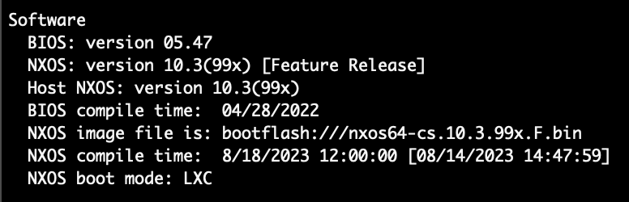
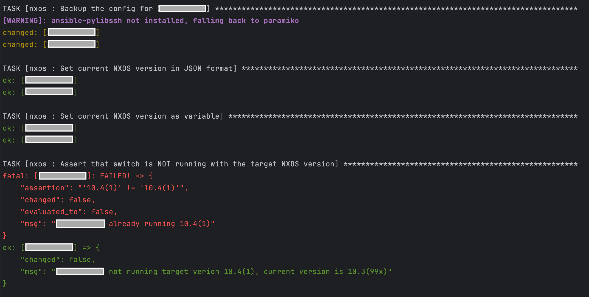
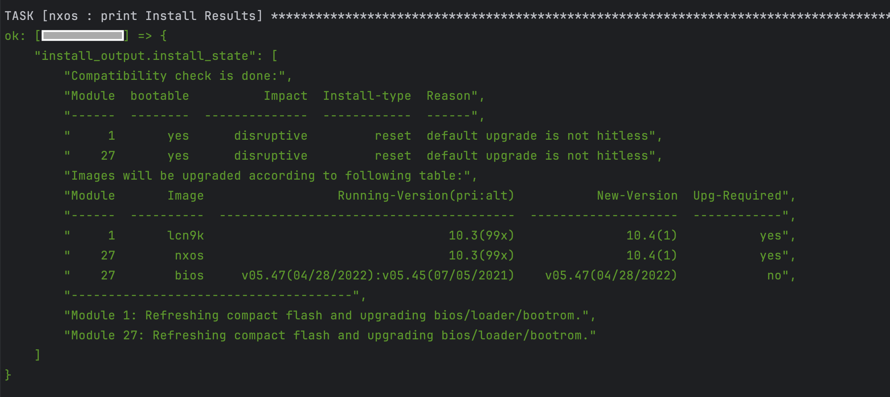
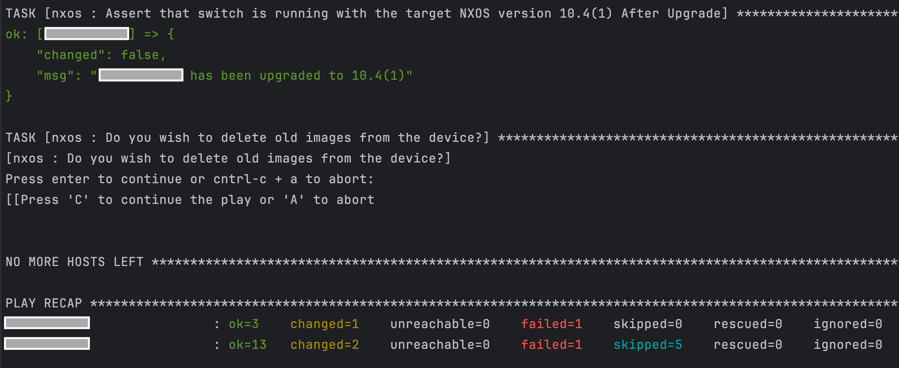
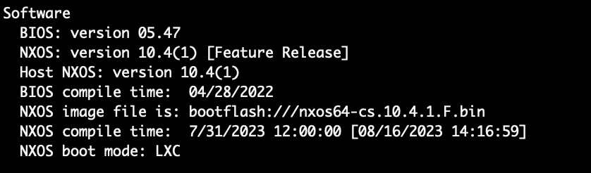

# Nexus 9000 Ansible Software Upgrade

This playbook automates the upgrade of the NXOS Software Version on a Nexus 9000 switch using Ansible. The primary Ansible collection used in this playbook is [Cisco.Nxos](https://docs.ansible.com/ansible/latest/collections/cisco/nxos/index.html), and the playbook follows the Nexus Software Upgrade instructions detailed [here](https://www.cisco.com/c/en/us/td/docs/dcn/nx-os/nexus9000/103x/upgrade/cisco-nexus-9000-nx-os-software-upgrade-downgrade-guide-103x/m-upgrading-or-downgrading-the-cisco-nexus-9000-series-nx-os-software.html).

A high level overview of the upgrade steps:
* Backup Current Switch Config
* SCP NXOS Binary File to Switch
* Upgrade NXOS Software Image
* (optional) Delete Old NXOS Image

**Note**: This playbook only focuses on upgrading the NXOS Software Version. It does not guarantee L2/L3 or VPC connectivity after upgrading. Manually verify or use a separate playbook to validate switch connectivity after the upgrade.

## Contacts
* Trevor Maco

## Solution Components
* Nexus 9000
* Ansible

## Prerequisites
#### NXOS Software Image
Download the desired NXOS Software Image from [Cisco Software Downloads](https://software.cisco.com/download/home). NXOS Binary Files are organized by Nexus Switch model and Software Version. 

Copy the `MD5 Checksum` by hovering over the file download. This value is required for Image Integrity Verification.



#### SCP Server
In order to copy the desired NXOS Binary to the Nexus Switch, a server which supports SCP is required (ex: Ubuntu 23.10 Server). Copy the binary file to the root (`/`) directory of the SCP Server.

**Note**: The SCP Server must be reachable from the Nexus Switch!

## Installation/Configuration
1. Clone this repository with `git clone [repository name]`
2. Rename the `inventory_sample` file to `inventory`.
3. Add the Nexus Switch IP Addresses to the `inventory` file.
```inventory
# inventory file for Ansible playbook

[nxos]
X.X.X.X
Y.Y.Y.Y
```
```
Note: It's assumed each switch is reachable via an SSH connection.
```
4. Add the Username and Password of the admin user to `roles/nxos/vars/main.yml`. These credentials will be used for authentication to all switches specified in `inventory`.
```yaml
---
# Global Variables for NXOS Playbook
ansible_connection: ansible.netcommon.network_cli
ansible_network_os: cisco.nxos.nxos
ansible_user: <nx_os_ssh_user_username>
ansible_password: <nx_os_ssh_user_password>
```
5. Add the SCP Server IP, Admin Username, and Admin Password for the SCP Server to `roles/nxos/vars/main.yml`. These credentials and IP will be used for the SCP command.
```yaml
# SCP Server Information (copying over image)
protocol: scp
scp_user: <scp_username>
scp_password: <scp_password>
scp_server: <scp_ip>
```
6. Add the desired NXOS Software Version number, Binary File Name, and MD5 Checksum values to `roles/nxos/vars/main.yml`. These values can be found from the software downloads site by hovering over the binary file download.
```yaml
# Upgrade Image Specifications (ex: 10.4(1))
target_nxos_ver: 10.4(1)
target_image: nxos64-cs.10.4.1.F.bin
target_image_md5: 2ac4a4b1558fa4eba7e363d5ad6dae72
```
7. (optional) Configure a different VRF used during copy of Binary File from SCP Server (Note: it's recommended to leave it as 'management')
```yaml
# Additional Nexus Configurations During Install
vrf: management
```
8. Set up a Python virtual environment. Make sure Python 3 is installed in your environment, and if not, you may download Python [here](https://www.python.org/downloads/). Once Python 3 is installed in your environment, you can activate the virtual environment with the instructions found [here](https://docs.python.org/3/tutorial/venv.html).
9. Install the requirements with `pip3 install -r requirements.txt`

## Usage
To run the playbook, use the command:

```bash
$ ansible-playbook -i inventory software_upgrade.yml
```

The main playbook content is located at: `roles/nxos/tasks/main.yml`. While the playbook runs, the output of the upgrade and various tasks are shown. 

This example run shows upgrading the NXOS Software Version from 10.3(99x) to 10.4(1).

```Before Running Playbook```



```Playbook Output:```





```After Running the Playbook:```




### LICENSE

Provided under Cisco Sample Code License, for details see [LICENSE](LICENSE.md)

### CODE_OF_CONDUCT

Our code of conduct is available [here](CODE_OF_CONDUCT.md)

### CONTRIBUTING

See our contributing guidelines [here](CONTRIBUTING.md)

#### DISCLAIMER:
<b>Please note:</b> This script is meant for demo purposes only. All tools/ scripts in this repo are released for use "AS IS" without any warranties of any kind, including, but not limited to their installation, use, or performance. Any use of these scripts and tools is at your own risk. There is no guarantee that they have been through thorough testing in a comparable environment and we are not responsible for any damage or data loss incurred with their use.
You are responsible for reviewing and testing any scripts you run thoroughly before use in any non-testing environment.